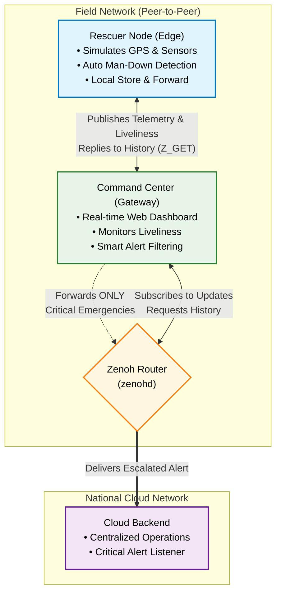

# Reverberus: Resilient Edge-to-Cloud Emergency System


Reverberus is an innovative, bandwidth-efficient IoT monitoring system designed for rescue teams operating in challenging, low-connectivity environments. 

Powered by **Eclipse Zenoh's** high-performance, peer-to-peer communication, the system acts as a resilient "Edge-to-Cloud" bridge. Local Edge nodes (Rescuers) communicate with a Command Center, which intelligently filters and forwards only critical alerts to a national Cloud backend, ensuring real-time tracking and emergency detection even when internet connectivity is intermittent.

## Key Features

* **Edge Intelligence:** Real-time GPS tracking and automatic "Man-Down" emergency detection executed directly on the edge node.
* **Smart Filtering (Gateway):** The Command Center acts as an intelligent gateway, minimizing network noise by forwarding only critical emergency data to the Cloud.
* **Store & Forward:** Localized data storage on rescuer devices allows historical telemetry queries (via `Z_GET`) without requiring constant cloud synchronization.
* **P2P Resiliency:** Utilizes Zenoh in peer-to-peer mode, guaranteeing that the local rescue team's network remains fully functional even if the connection to the Cloud is severed.
* **Live Dashboard:** A real-time web UI and terminal dashboard to monitor operator status, liveliness, and telemetry.

---

## System Architecture

The following Mermaid diagram outlines the C4 Component architecture of Reverberus, highlighting how data moves decentralizedly between the edge, gateway, and cloud endpoints.


1. **Rescuer Node (Edge):** Worn by the operator. Simulates GPS and telemetry data, monitors for "Man-Down" events, and stores data locally.
2. **Zenoh Router (`zenohd`):** The communication backbone facilitating decentralized pub/sub and queryable traffic.
3. **Command Center (Gateway):** Monitors all operators, hosts the Web Dashboard, and acts as a gateway to the Cloud.
4. **Cloud Backend:** A centralized listener that receives only high-priority, filtered alerts from the Command Center.

---

## Getting Started

### Prerequisites
Before you begin, ensure you have the following installed:
* **Python 3.10** or higher.
* **Git** for cloning the repository.
* **Zenoh Router (`zenohd`)**: Download the pre-compiled binary for your OS (Windows, Linux, or macOS) from the [Eclipse Zenoh Releases page](https://github.com/eclipse-zenoh/zenoh/releases).

### Installation

1. **Clone the repository:**
   ```bash
   git clone [https://github.com/ale613/reverberus.git](https://github.com/ale613/reverberus.git)
   cd reverberus
   ```

2. **Set up a virtual environment (Recommended):**
   ```bash
   python -m venv venv
   
   # On Windows:
   venv\Scripts\activate
   
   # On Linux/macOS:
   source venv/bin/activate
   ```

3. **Install the dependencies:**
   ```bash
   pip install -r requirements.txt
   ```

4. **Environment Configuration:**
   Create a `.env` file in the root directory to manage your network settings and personal rescuer data. You can copy the following template into your `.env` file:

   ```env
   # ==========================================
   # Reverberus Environment Configuration
   # ==========================================

   # --- Global / Zenoh Network ---
   # The IP address where your Zenoh Router (zenohd) is running
   ROUTER_IP=25.7.53.21
   # ROUTER_IP=127.0.0.1 # Uncomment for local-only testing

   # --- Command Center ---
   FLASK_HOST=0.0.0.0
   FLASK_PORT=8080

   # --- Rescuer Node (Personal Data) ---
   TEAM=alpha
   OPERATOR_ID=op_123
   ```

---

## Usage & Running the Demo

To run the full simulation locally, you will need to open **four separate terminal windows**. Ensure your virtual environment is activated in each one.

### 1. Start the Zenoh Router
This routes the traffic between all nodes. 
* **Windows:** `.\zenohd.exe -l tcp/0.0.0.0:7447`
* **Linux/macOS:** `./zenohd -l tcp/0.0.0.0:7447`

### 2. Start the Cloud Backend
Acts as the national command center, listening for escalated alerts.
```bash
python -m cloud_backend
```

### 3. Start the Command Center & Web UI
Connects to the router, monitors the local team, and starts the Web Dashboard on port 8080.
```bash
python -m main_cmd_center
```
*(Once running, you can view the dashboard by navigating to `http://localhost:8080` in your browser).*

### 4. Start the Rescuer Node
Simulates a rescue operator in the field. It will immediately begin publishing telemetry and simulating movement using the `TEAM` and `OPERATOR_ID` specified in your `.env` file.
```bash
python -m main_rescuer
```

> **💡 Testing the "Man-Down" Feature:**
> The `main_rescuer` script uses a sensor simulator that has a 5% chance every loop to simulate the operator stopping. If they remain stationary for 12 seconds, a `MAN_DOWN` alert will trigger on the Command Center and automatically forward to the Cloud Backend!

---

## Contributing

We welcome contributions from the community! Whether it's adding support for real hardware sensors, improving the web UI, or optimizing the Zenoh queries, your help is appreciated.

1. Fork the Project
2. Create your Feature Branch (`git checkout -b feature/AmazingFeature`)
3. Commit your Changes (`git commit -m 'Add some AmazingFeature'`)
4. Push to the Branch (`git push origin feature/AmazingFeature`)
5. Open a Pull Request

---

## License

This project is licensed under the **MIT License**. See the [LICENSE](LICENSE) file for more information.

## Contact

This project was made by Alessandro Melis and Lorenzo Susino from University of Cagliari